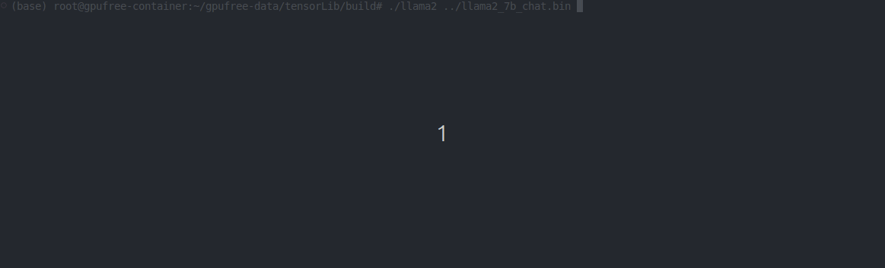
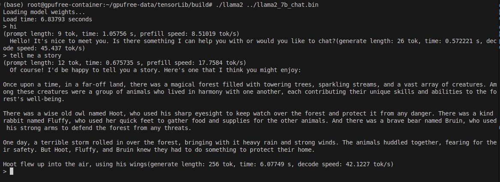

# tensorLib
TensorLib is a tensor library for inference of large language models. It supports `cpu` and `cuda` backend.





# Build
```
mkdir build
cd build
cmake ..
make
```

Make sure you have installed `cuda`, `openmp` and other dependencies.

# Debug
Uncomment `set(CMAKE_BUILD_TYPE Debug)` in `CmakeLists.txt`.


# Test
C++ or python frameworks is used to test the code.
## python test
I have use pybind11 to wrap the c++ code to python. So you can use python to test the code. Pytorch and numpy is used to test the correctness of the Tensor functions.

# Model
Llama2-7b is supported now. see [llama2.c](https://github.com/karpathy/llama2.c) about how to acquire the model weghts.

The script which can export fp16 weights is in [script](script) folder. It is modified from above project.
# Acknowledgement
This project inspired by following projects:

[llama2.c](https://github.com/karpathy/llama2.c)

[CMU10_414](https://dlsyscourse.org/lectures/)

[llm.c](https://github.com/karpathy/llm.c)

[llama.cpp](https://github.com/ggml-org/llama.cpp)

[simpleTensor](https://github.com/XuHQ1997/simple-tensor/tree/main)

# Miscellaneous

This project is in very early stage.  Limmited by my knowledge and time, I have not considered many details.  So some inplementation details are not well thought out and not elegant.  But I will try to improve it in the future.

